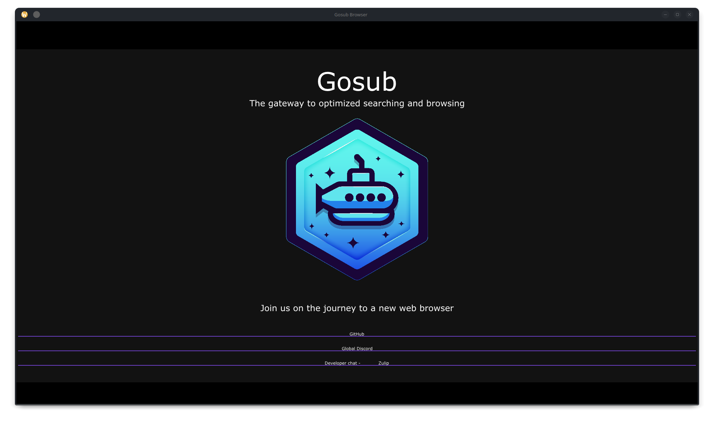
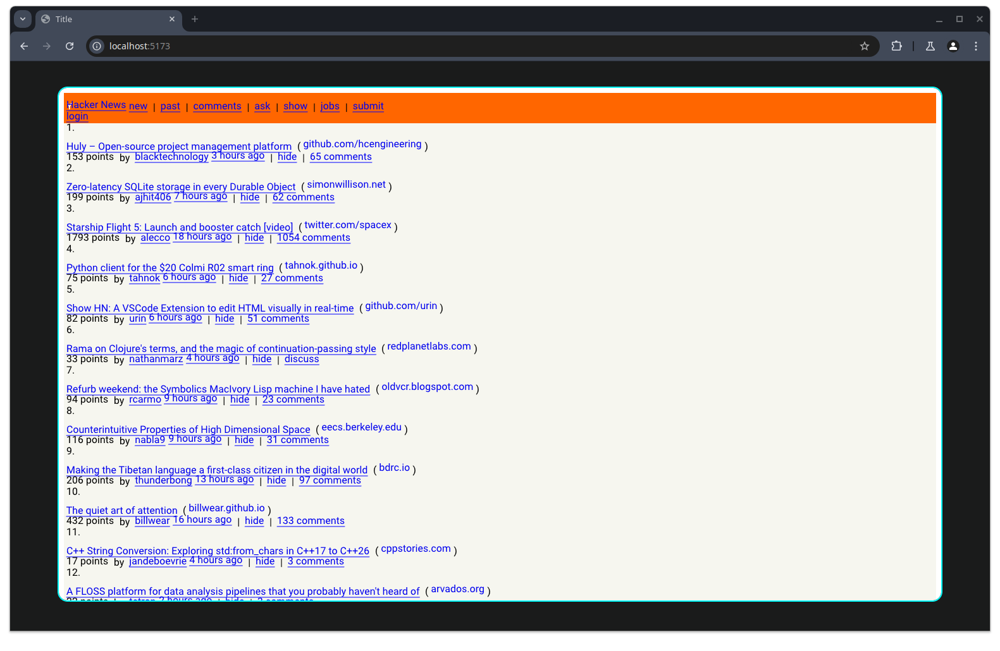

# Gosub: Gateway to Optimized Searching and Unlimited Browsing

This repository holds the Gosub browser engine. It will become a standalone library that can be used by other projects
but will ultimately be used by the Gosub browser user-agent. See the [About](#about) section for more information.

Join us at our development [Zulip chat](https://chat.developer.gosub.io)!

For more general information you can also join our [Discord server](https://chat.gosub.io).

If you are interested in contributing to Gosub, please check out the [contribution guide](CONTRIBUTING.md)!


## About

This repository is part of the Gosub browser engine project. This is the main engine that holds the following components:

- HTML5 tokenizer / parser
- CSS3 tokenizer / parser
- Document tree
- Several APIs for connecting to javascript
- Configuration store
- Networking stack
- Rendering engine
- JS bridge

More will follow as the engine grows. The idea is that this engine will receive some kind of stream of bytes (most likely 
from a socket or file) and parse this into a valid HTML5 document tree and CSS stylesheets.
From that point, it can be fed to a renderer engine that will render the document tree into a window, or it can be fed
to a more simplistic engine that will render it in a terminal. JS can be executed on the document tree and the document 
tree can be modified by JS.


## Status

> This project is in its infancy. There is no usable browser yet. However, you can look at simple html pages and parse
> them into a document tree and do some initial rendering.

We can parse HTML5 and CSS3 files into a document tree or the respective css tree. This tree can be shown in the terminal 
or be rendered in a very unfinished renderer. Our renderer cannot render everything yet, but it can render simple html 
pages, sort of.

We already implemented other parts of the engine, for a JS engine, networking stack, a configuration store and other
things however these aren't integrated yet. You can try these out by running the respective binary.

We can render a part for our own [site](https://gosub.io):




## How to run

<details>
<summary> Installing dependencies </summary>


This project uses [cargo](https://doc.rust-lang.org/cargo/) and [rustup](https://www.rust-lang.org/tools/install). First
you must install `rustup` at the link provided. After installing `rustup`, run:

```bash
$ rustup toolchain install 1.73
$ rustc --version
rustc 1.73.0 (cc66ad468 2023-10-03)
```

Once Rust is installed, run this command to pre-build the dependencies:

```bash
$ cargo build --release
```

</details>


You can run the following binaries:

| Command                                | Type | Description                                                                                                                                                     |
|----------------------------------------|------|-----------------------------------------------------------------------------------------------------------------------------------------------------------------|
| `cargo run -r --bin config-store`      | bin  | A simple test application of the config store for testing purposes                                                                                              |
| `cargo run -r --bin css3-parser`       | bin  | Show the parsed css tree                                                                                                                                        |
| `cargo run -r --bin display-text-tree` | bin  | A simple parser that will try and return a textual presentation of the website                                                                                  |
| `cargo run -r --bin gosub-parser`      | bin  | The actual html5 parser/tokenizer that allows you to convert html5 into a document tree.                                                                        |
| `cargo run -r --bin html5-parser-test` | test | A test suite that tests all html5lib tests for the treebuilding                                                                                                 |
| `cargo run -r --bin parser-test`       | test | A test suite for the parser that tests specific tests. This will be removed as soon as the parser is completely finished as this tool is for developement only. |
| `cargo run -r --bin renderer`          | bin  | Render a html page (WIP)                                                                                                                                        |
| `cargo run -r --bin run-js`            | bin  | Run a JS file (Note: console and event loop are not yet implemented)                                                                                            |

For running the binaries, take a look at a quick introduction at [/docs/binaries.md](/docs/binaries.md)


## Benchmark and test suites

To run the tests and benchmark suite, do:

```bash
make test
cargo bench
ls target/criterion/report
index.html
```

## Wasm

Our engine can also be compiled to WebAssembly. You need to use WasmPack for this. To build the Wasm version, run:

```bash
wasm-pack build --target web
```

Afterwards you need to serve the small useragent around the wasm version in the `wasm/` directory. You can do this by

```bash
cd wasm
npm run dev  # you can also use `bun run dev`
 ```

To use this demo, you need to enable webgpu in chromium and disable the same origin policy.

```bash
chromium --disable-web-security --enable-features=Vulkan --enable-unsafe-webgpu --user-data-dir=/tmp/chromium-temp-profile 
``` 

This command works on Linux only, if someone uses Windows or macOS, please open an PR!

And then you have it! A browser in a browser:




## Contributing to the project

We welcome contributions to this project but the current status makes that we are spending a lot of time researching,
building small proof-of-concepts and figuring out what needs to be done next. Much time of a contributor at this stage
of the project will be non-coding.

We do like to hear from you if you are interested in contributing to the project and you can join us currently at
our [Zulip chat](https://chat.developer.gosub.io)!