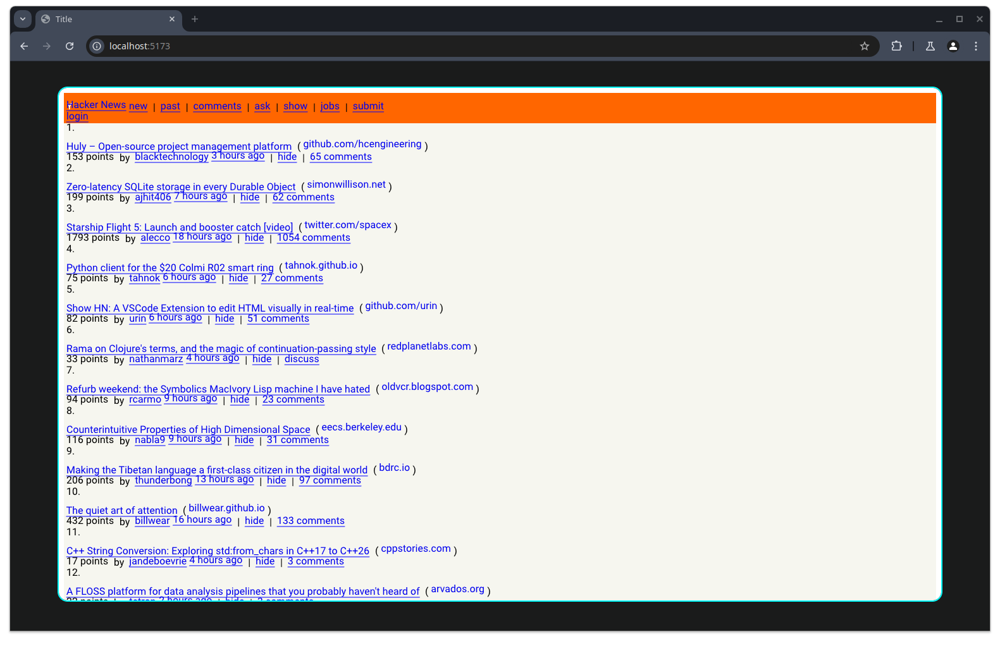

# Gosub Browser Engine

An embeddable, async browser engine written in Rust.

Join us at our development [Zulip chat](https://chat.developer.gosub.io)!

For more general information you can also join our [Discord server](https://chat.gosub.io).

If you are interested in contributing to Gosub, please check out the [contribution guide](CONTRIBUTING.md)!


## About

Gosub is a modular, embeddable browser engine. The primary entry point is `GosubEngine` in the
[`gosub_engine`](crates/gosub_engine) crate. You provide a render backend and a compositor; the
engine owns a multi-zone/tab model, an async networking stack, cookie and storage isolation per
zone, and an event bus. Your user-agent (UA) drives everything via `TabCommand` and reacts to
`EngineEvent`.

**Core components:**

| Crate | Role |
|---|---|
| `gosub_engine` | `GosubEngine` — the unified entry point |
| `gosub_html5` | HTML5 tokenizer / parser |
| `gosub_css3` | CSS3 tokenizer / parser |
| `gosub_net` | Networking stack (async, streaming, per-zone) |
| `gosub_taffy` | Layout engine (Taffy/flexbox) |
| `gosub_cairo` | Cairo / GTK4 render backend |
| `gosub_vello` | Vello / wgpu render backend |
| `gosub_jsapi` | Browser Web API implementations (console, fetch, DOM, …) |
| `gosub_v8` | V8 JavaScript engine bindings |
| `gosub_config` | Configuration store |

For the full crate listing see [`docs/crates.md`](docs/crates.md).


## Status

The engine is under active development. What works today:

- **Multi-zone / multi-tab model** — zones isolate cookies and storage; tabs are controlled via `TabCommand`
- **Async networking** — streaming HTTP fetcher with priority queues, inflight coalescing, redirect handling, and per-zone cookie isolation
- **Event-driven UA interface** — `EngineEvent` (navigation, resource, redraw) flows out; `TabCommand` / `EngineCommand` flow in
- **HTML5 and CSS3 parsing** — spec-compliant parsers for both
- **Pluggable render backends** — Null (headless), Cairo (GTK4), Vello (wgpu)

What is still in progress:

- Full page layout and rendering pipeline (the render backends receive geometry but pixel-perfect output is incomplete)
- JavaScript execution integration
- Accessibility tree


## Quick start

Add `gosub_engine` to your `Cargo.toml`:

```toml
[dependencies]
gosub_engine = { git = "https://github.com/gosub-io/gosub-engine", package = "gosub_engine" }
tokio = { version = "1", features = ["full"] }
```

Then drive the engine from async code:

```rust
use std::sync::{Arc, RwLock};
use gosub_engine::{EngineConfig, GosubEngine, EngineError};
use gosub_engine::render::{DefaultCompositor, Viewport};
use gosub_engine::render::backends::null::NullBackend;
use gosub_engine::events::{EngineEvent, TabCommand};
use gosub_engine::storage::{StorageService, InMemoryLocalStore, InMemorySessionStore, PartitionPolicy};
use gosub_engine::cookies::DefaultCookieJar;
use gosub_engine::zone::{ZoneConfig, ZoneServices};
use gosub_engine::tab::TabDefaults;

#[tokio::main]
async fn main() -> Result<(), EngineError> {
    let backend = NullBackend::new().expect("backend");
    let mut engine = GosubEngine::new(
        Some(EngineConfig::default()),
        Arc::new(backend),
        Arc::new(RwLock::new(DefaultCompositor::default())),
    );
    engine.start().expect("start");

    let mut events = engine.subscribe_events();

    let services = ZoneServices {
        storage: Arc::new(StorageService::new(
            Arc::new(InMemoryLocalStore::new()),
            Arc::new(InMemorySessionStore::new()),
        )),
        cookie_store: None,
        cookie_jar: Some(DefaultCookieJar::new().into()),
        partition_policy: PartitionPolicy::None,
    };
    let mut zone = engine.create_zone(ZoneConfig::default(), services, None)?;

    let tab = zone.create_tab(TabDefaults {
        viewport: Some(Viewport::new(0, 0, 1280, 800)),
        ..Default::default()
    }, None).await?;

    tab.send(TabCommand::Navigate { url: "https://example.com".into() }).await?;

    while let Ok(ev) = events.recv().await {
        match ev {
            EngineEvent::Navigation { tab_id, event } => println!("[{tab_id}] {event:?}"),
            EngineEvent::Redraw { tab_id, .. }        => println!("[{tab_id}] frame ready"),
            _ => {}
        }
    }

    engine.shutdown().await?;
    Ok(())
}
```

See [`examples/hello-world.rs`](examples/hello-world.rs) for a fuller walkthrough, and
[`examples/multi-tab.rs`](examples/multi-tab.rs) for a 25-tab stress test with a live progress UI.


## Running the examples

<details>
<summary>Installing dependencies</summary>

This project uses [cargo](https://doc.rust-lang.org/cargo/) and [rustup](https://www.rust-lang.org/tools/install).
Install `rustup`, then:

```bash
rustup default stable
```

For the GTK4-based examples you also need these OS packages (Ubuntu / Debian):

```
make gcc g++
libglib2.0-dev libcairo2-dev libpango1.0-dev
libgdk-pixbuf-2.0-dev libgraphene-1.0-dev libgtk-4-dev
libsqlite3-dev
```

Clone and build:

```bash
git clone https://github.com/gosub-io/gosub-engine.git
cd gosub-engine
cargo build
```
</details>

### Engine examples (no GUI required)

| Command | Description |
|---|---|
| `cargo run --example hello-world` | Single tab — navigate a URL, stream events to stdout |
| `cargo run --example multi-tab` | 25 tabs navigating random sites; live progress bars via `indicatif` |

### GUI examples

| Command | Description |
|---|---|
| `cargo run --example gtk-cairo` | GTK4 / Cairo window |
| `cargo run --example egui-vello` | egui / Vello / wgpu window |

### Component tools (individual crate testing)

| Command | Description |
|---|---|
| `cargo run --bin gosub-parser` | HTML5 parser / tokenizer — prints a document tree |
| `cargo run --bin css3-parser` | CSS3 parser — prints a CSS tree from a URL |
| `cargo run --bin display-text-tree` | Text-only render of a page |
| `cargo run --bin config-store` | Config store smoke test |
| `cargo run --bin run-js` | Run a JS file (event loop not yet implemented) |
| `cargo run --bin html5-parser-test` | html5lib tree-builder test suite |
| `cargo run --bin parser-test` | Parser development test runner |

For more detail on the component tools see [/docs/binaries.md](/docs/binaries.md).


## Tests and benchmarks

```bash
make test
cargo bench
# open target/criterion/report/index.html
```


## WebAssembly

The engine can be compiled to WebAssembly via `wasm-pack`:

```bash
wasm-pack build --target web
```

Then serve the thin UA wrapper in `wasm/`:

```bash
cd wasm
bun run dev   # or: npm run dev
```

To run the demo you need a Chromium with WebGPU enabled:

```bash
# Linux only — PRs welcome for Windows / macOS
chromium --disable-web-security --enable-features=Vulkan \
         --enable-unsafe-webgpu --user-data-dir=/tmp/chromium-temp-profile
```




## Contributing

We welcome contributions. Because the engine is still taking shape, a lot of work is exploratory
— building proofs-of-concept, reading specs, and making architectural decisions — rather than
pure coding.

Join us on [Zulip](https://chat.developer.gosub.io) or [Discord](https://chat.gosub.io) before
diving in; it will save you time and help us keep things coordinated.
