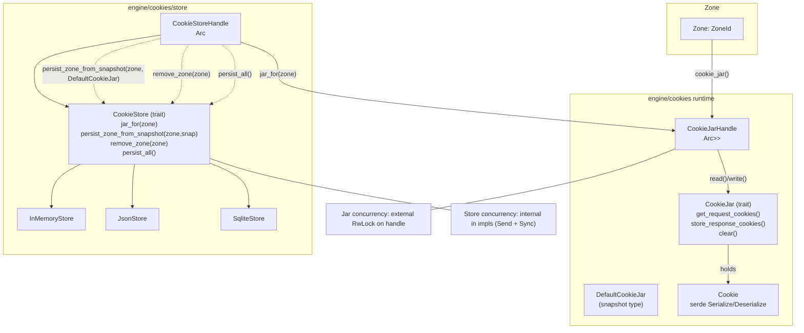

# Architecture: Cookies subsystem

## Scope
- Runtime cookie management within a zone using a `CookieJar`.
- Persistence and restoration across runs using a `CookieStore`.
- Type‑erased handles for safe and concurrent access by the engine.

## Directory layout
- `src/engine/cookies/cookies.rs`: type‑erased handles and serializable `Cookie`.
- `src/engine/cookies/cookie_jar.rs`: `CookieJar` trait and default behaviors.
- `src/engine/cookies/persistent_cookie_jar.rs`: `DefaultCookieJar` snapshot type.
- `src/engine/cookies/store.rs`: `CookieStore` trait.
- `src/engine/cookies/store/in_memory.rs`: in‑memory store.
- `src/engine/cookies/store/json.rs`: JSON store.
- `src/engine/cookies/store/sqlite.rs`: SQLite store.
- `src/engine/zone/zone.rs`: `Zone` and `ZoneId` integration points.

## Key concepts
- `CookieJar` (runtime)
    - Per‑zone working set used during request/response handling.
    - Typical calls: `get_request_cookies(url)`, `store_response_cookies(url, headers)`, `clear()`.
    - Accessed via `CookieJarHandle = Arc<RwLock<Box<dyn CookieJar + Send + Sync>>>`.
- `CookieStore` (persistence/factory)
    - Creates/restores per‑zone jars and persists or removes them.
    - Typical calls: `jar_for(zone)`, `persist_zone_from_snapshot(zone, snap)`, `remove_zone(zone)`, `persist_all()`.
    - Exposed as `CookieStoreHandle = Arc<dyn CookieStore + Send + Sync>`.
- `Cookie` (data model)
    - Serializable struct for persistence and inspection.
    - Fields: `name`, `value`, `path`, `domain`, `secure`, `expires`, `same_site`, `http_only`.

## Concurrency model
- `CookieJarHandle`
    - `RwLock` outside the trait object.
    - Read lock for queries, write lock for mutations.
- `CookieStoreHandle`
    - Only `&self` methods; implementations must be internally synchronized.
    - Store impls are `Send + Sync` and may use `Mutex`, pools, or transactional back ends.

## Component view

## Responsibilities and boundaries
- Zone owns the `CookieJarHandle` for its lifetime; it does not depend on the store during hot path.
- Store is used at zone bootstrap for `jar_for` and at persistence points for `persist_zone_from_snapshot` or `persist_all`.
- All jar read/write coordination happens via the handle `RwLock`; stores do not participate in jar locking.

## Error handling and durability
- Store implementations decide durability semantics:
    - `in_memory`: ephemeral, process‑lifetime only.
    - `json`: human‑readable file; fs atomicity recommended in impl.
    - `sqlite`: transactional durability; concurrent access via connection pool.
- Trait methods on stores take `&self`; impls must guard internal state.

## Extension points
- New jar implementation
    - Implement `CookieJar + Send + Sync`.
    - Wrap with `CookieJarHandle::new(your_impl)`.
- New store implementation
    - Implement `CookieStore + Send + Sync` with internal synchronization.
    - Decide snapshot format; use `DefaultCookieJar` as the interchange.

## Integration touch‑points
- `Zone` obtains and exposes `CookieJarHandle` \(`src/engine/zone/zone.rs`\).
- Net pipeline \(`src/net/fetch.rs`\) reads jar before requests and writes back on responses.
- Persist triggers can be explicit calls \(`persist_zone_from_snapshot`, `persist_all`\) during shutdown or checkpoints.