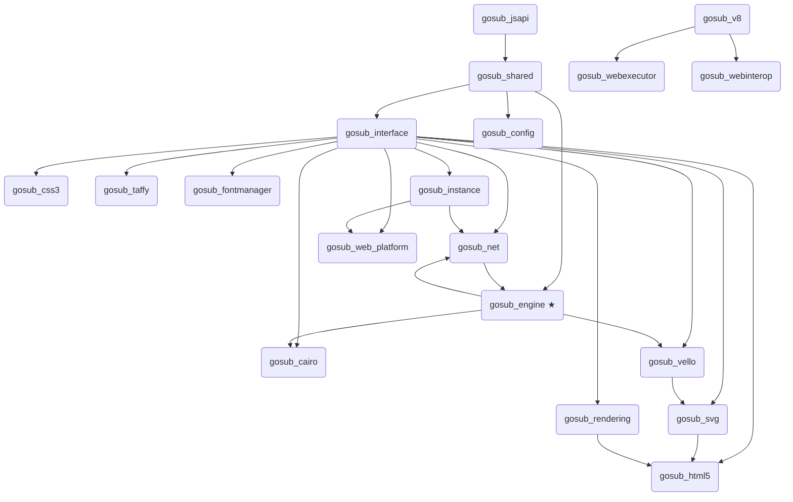

# Gosub crates

The engine is a Cargo workspace split into focused crates. Each crate owns one concern; the
`gosub_engine` crate is the unified entry point that ties them together for downstream users.

## Entry point

### gosub_engine
The primary public API. Exposes `GosubEngine`, the `Zone`/`Tab` model, the async networking
stack, cookie and storage isolation, and the `EngineEvent` / `TabCommand` event bus. This is
what you depend on if you are building a user agent or embedding the browser engine.

See [`examples/hello-world.rs`](../examples/hello-world.rs) for a minimal integration example.

---

## Parsing

### gosub_html5
HTML5 tokenizer and parser. Produces a `Document` / DOM tree. Conforms to the HTML5 spec,
including error recovery. Also holds the `Document`, `Node`, and related DOM types.

### gosub_css3
CSS3 tokenizer and parser. Parses stylesheets into a `CssStylesheet` (rules, selectors,
declarations). Includes a property-value syntax checker for validating CSS property values
against their formal grammar.

---

## Layout and rendering

### gosub_taffy
Layout engine. Implements layout traits backed by the [Taffy](https://github.com/DioxusLabs/taffy)
flexbox/grid library.

### gosub_rendering
Render tree. Converts the DOM + CSSOM into a flat render tree with resolved styles and
positions, ready to be handed to a render backend.

### gosub_fontmanager
Font loading and management. Provides a font manager abstraction used by the render backends.

### gosub_svg
SVG document support backed by `usvg` and optionally `resvg`.

---

## Render backends

### gosub_cairo
Cairo / GTK4 render backend. Implements the `RenderBackend` trait from `gosub_engine` using
the Cairo 2D graphics library. Used by the `gtk-cairo` example.

### gosub_vello
Vello / wgpu render backend. Implements the `RenderBackend` trait using the Vello vector
renderer on top of wgpu. Used by the `egui-vello` example.

---

## Networking

### gosub_net
Network utilities. Re-exports the async networking stack from `gosub_engine` (streaming HTTP
fetcher, per-zone cookie isolation, redirect handling) and hosts lower-level helpers used by
the old renderer path.

---

## JavaScript

### gosub_v8
Rust bindings to the V8 JavaScript engine.

### gosub_webexecutor
JavaScript (and future scripting language) execution runtime. Wraps V8 and provides a
consistent interface for running scripts inside a browsing context.

### gosub_webinterop
Proc-macro crate. Provides macros for easily exposing Rust functions as JavaScript / Wasm / Lua
APIs without hand-writing the binding glue.

### gosub_jsapi
Implementations of browser Web APIs (console, fetch, DOM, etc.) that are callable from
JavaScript inside the engine.

---

## Infrastructure

### gosub_shared
Shared types, error types, byte streams, and geometry primitives used throughout the workspace.
Most other crates depend on this.

### gosub_interface
Trait definitions for the major engine components (render backend, layout, CSS system, font
manager, event loop, etc.). Crates implement these traits; `gosub_engine` wires them together.

### gosub_config
Configuration store. Supports multiple backends (SQLite, JSON) and provides a key/value API
for engine and UA settings.

### gosub_instance
Ties together a single browsing instance: the event loop, input handling, layout, and the
render backend. Used by the legacy GTK/Vello renderer path.

### gosub_web_platform
Web platform event loop implementation. Manages the JS/Lua runtime lifecycle, timers, and
event listeners for a browsing context.

---

## Dependency overview

★ = primary entry point for downstream users
