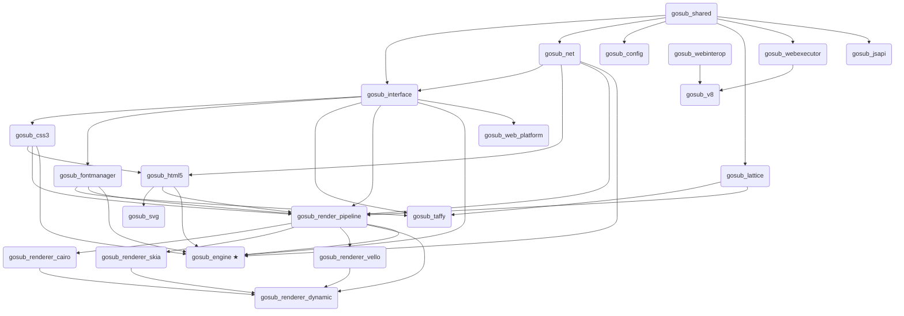

# Gosub crates

The engine is a Cargo workspace split into focused crates. Each crate owns one concern; the
`gosub_engine` crate is the unified entry point that ties them together for downstream users.

## Entry point

### gosub_engine
The primary public API. Exposes `GosubEngine`, the `Zone`/`Tab` model, the async networking
stack, cookie and storage isolation, and the `EngineEvent` / `TabCommand` event bus. This is
what you depend on if you are building a user agent or embedding the browser engine.

See [`examples/hello-world.rs`](../examples/hello-world.rs) for a minimal integration example,
and [`configuration.md`](configuration.md) for how to choose a render backend.

---

## Parsing

### gosub_html5
HTML5 tokenizer and parser. Produces a `Document` / DOM tree. Conforms to the HTML5 spec,
including error recovery. Also holds the `Document`, `Node`, and related DOM types.

### gosub_css3
CSS3 tokenizer and parser. Parses stylesheets into a `CssStylesheet` (rules, selectors,
declarations). Includes a property-value syntax checker for validating CSS property values
against their formal grammar.

---

## Layout and rendering

### gosub_taffy
Flexbox / grid layout backed by the [Taffy](https://github.com/DioxusLabs/taffy) library.
Implements the layout traits from `gosub_interface`.

### gosub_lattice
CSS table layout engine — handles the table layout algorithm that Taffy does not cover.

### gosub_render_pipeline
The render pipeline. Converts the DOM + CSSOM into a render tree with resolved styles and
positions, runs the paint stages, tiles the output, and composites it. Render backends plug in
here; this is the crate they implement against.

### gosub_fontmanager
Font loading and management. Provides the font system abstraction used for text shaping /
measurement by layout and shared with the render backends for drawing. See [fonts.md](fonts.md)
for the full picture (font systems vs text rasterizers).

### gosub_svg
SVG document support backed by `usvg` and optionally `resvg`.

---

## Render backends

Each backend implements the `RenderBackend` trait against `gosub_render_pipeline`. You select
one at compile time via the engine config — see [`configuration.md`](configuration.md).

### gosub_renderer_cairo
Cairo render backend (CPU), with Pango text rendering. Used by the `winit-cairo`, `gtk4-cairo`,
and `egui-cairo` examples.

### gosub_renderer_skia
Skia render backend (CPU or GPU). Used by the `*-skia` and `*-skia-gpu` examples.

### gosub_renderer_vello
Vello / wgpu render backend (GPU). Generic over a `WgpuContextProvider`. Used by the
`winit-vello` and `egui-vello` examples.

### gosub_renderer_dynamic
Runtime-selectable backend that bundles Cairo, Skia, and Vello behind a single `RenderBackend`,
chosen at runtime via feature flags rather than at the type level.

---

## Networking

### gosub_net
The async networking stack: streaming HTTP fetcher with priority queues, inflight coalescing,
redirect handling, and per-zone cookie isolation, plus lower-level helpers. Consumed by
`gosub_engine`.

> Note: this crate is moving to its own project, **gosub_sonar**, which carries its own
> documentation. The [network docs](network/) here describe the in-tree crate until the
> move completes.

---

## JavaScript

### gosub_v8
Rust bindings to the V8 JavaScript engine.

### gosub_webexecutor
JavaScript (and future scripting language) execution runtime. Wraps V8 and provides a
consistent interface for running scripts inside a browsing context.

### gosub_webinterop
Proc-macro crate. Provides macros for easily exposing Rust functions as JavaScript / Wasm / Lua
APIs without hand-writing the binding glue.

### gosub_jsapi
Implementations of browser Web APIs (console, fetch, DOM, etc.) that are callable from
JavaScript inside the engine.

---

## Infrastructure

### gosub_shared
Shared types, error types, byte streams, and geometry primitives used throughout the workspace.
Nearly every other crate depends on this.

### gosub_interface
Trait definitions for the major engine components (render backend, layout, CSS system, font
system, document, etc.). Crates implement these traits; `gosub_engine` wires them together. See
[`configuration.md`](configuration.md) for how `ModuleConfiguration` / `RenderConfiguration` use
them.

### gosub_config
Configuration store. Supports multiple backends (SQLite, JSON) and provides a key/value API
for engine and UA settings.

### gosub_web_platform
Web platform event loop implementation. Manages the JS/Lua runtime lifecycle, timers, and
event listeners for a browsing context.

---

## Dependency overview

Arrows point from a crate to the crates that depend on it (i.e. build/data flows upward).
`gosub_shared` underlies nearly everything and most of its edges are omitted for clarity.

★ = primary entry point for downstream users
