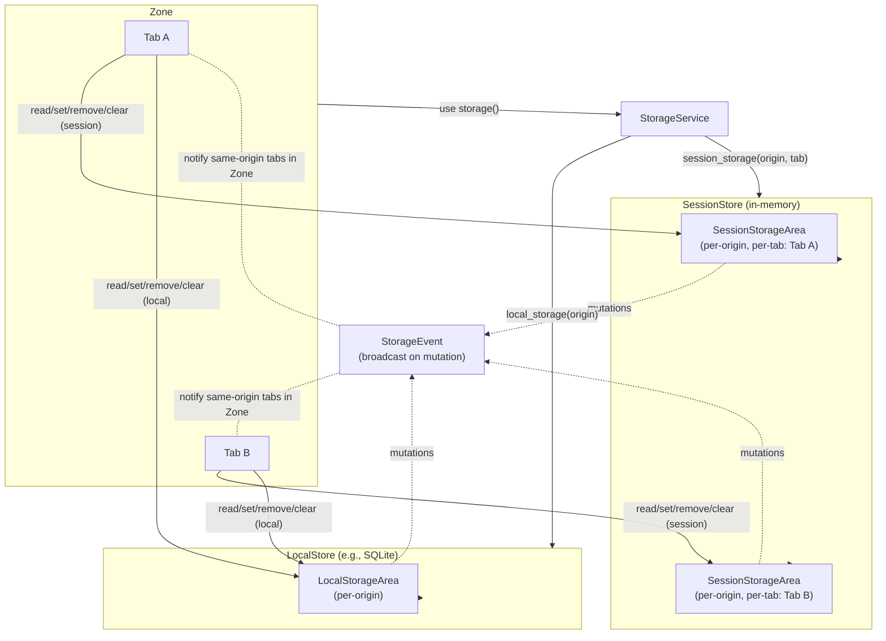
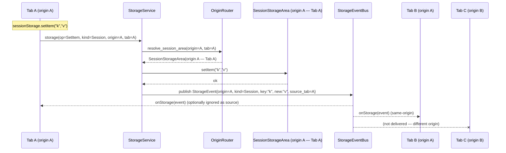

# Architecture: Storage subsystem (local and session)

## Scope
- Web Storage runtime for per\-origin key/value maps: `localStorage` (persistent) and `sessionStorage` (ephemeral).
- Service layer that routes reads/writes, enforces scoping, and emits storage events.

## Directory layout
- `src/engine/storage/area.rs`: storage area abstraction (key/value operations).
- `src/engine/storage/service.rs`: orchestration, lookup by zone/tab/origin, event wiring.
- `src/engine/storage/types.rs`: shared types (keys, values, origins, quotas).
- `src/engine/storage/event.rs`: `StorageEvent` emission.
- `src/engine/storage/local/in_memory.rs`: in\-memory local storage backend.
- `src/engine/storage/local/sqlite_store.rs`: SQLite local storage backend.
- `src/engine/storage/session/in_memory.rs`: in\-memory session storage backend.

## Key concepts
- StorageArea (runtime)
    - Per\-origin key/value map with typical operations: get, set, remove, clear, len, keys.
    - Session areas are scoped to a tab/session; local areas are per origin and durable.
- StorageService (orchestration)
    - Resolves a storage area for a given `Zone`/tab and origin.
    - Emits `StorageEvent` to other tabs of the same origin on mutations.
    - Mediates persistence for local storage via the selected backend.
- Stores and durability
    - Local: in\-memory (ephemeral) or SQLite (durable across runs).
    - Session: in\-memory only; discarded when the tab/session ends.

## Concurrency model
- Areas and stores are `Send + Sync`; implementations perform internal synchronization.
- Service exposes cheap handles and never blocks hot read paths longer than necessary.
- Cross\-tab notifications are delivered via the engine event bus.

## Component view



```svg
<svg xmlns="http://www.w3.org/2000/svg" width="980" height="520" viewBox="0 0 980 520">
  <style>
    .box { fill:#fff; stroke:#333; rx:10; ry:10; }
    .title { font: 600 14px/1.2 system-ui, sans-serif; }
    .small { font: 12px/1.3 system-ui, sans-serif; }
    .mono { font: 12px/1.3 ui-monospace, SFMono-Regular, Menlo, monospace; }
    .arrow { stroke:#333; marker-end:url(#arrow); fill:none; }
    .dashed { stroke-dasharray:5 4; }
    .pill { fill:#eef5ff; stroke:#99b6ff; }
  </style>
  <defs>
    <marker id="arrow" viewBox="0 0 10 10" refX="8" refY="5" markerWidth="8" markerHeight="8" orient="auto-start-reverse">
      <path d="M 0 0 L 10 5 L 0 10 z" fill="#333"/>
    </marker>
  </defs>

  <!-- Zone -->
  <rect x="20" y="20" width="280" height="220" class="box"/>
  <text x="30" y="42" class="title">Zone</text>
  <rect x="40" y="70" width="110" height="50" class="pill"/>
  <text x="55" y="90" class="small">Tab A</text>
  <rect x="40" y="140" width="110" height="50" class="pill"/>
  <text x="55" y="160" class="small">Tab B</text>

  <!-- StorageService -->
  <rect x="340" y="70" width="180" height="60" class="box"/>
  <text x="350" y="92" class="title">StorageService</text>
  <text x="350" y="112" class="mono">local_storage(origin)<tspan x="350" dy="16">session_storage(origin, tab)</tspan></text>

  <!-- LocalStore -->
  <rect x="560" y="20" width="390" height="200" class="box"/>
  <text x="570" y="42" class="title">LocalStore (SQLite)</text>
  <rect x="580" y="80" width="180" height="60" class="pill"/>
  <text x="590" y="102" class="small">LocalStorageArea</text>
  <text x="590" y="120" class="mono">(per-origin)</text>

  <!-- SessionStore -->
  <rect x="560" y="240" width="390" height="260" class="box"/>
  <text x="570" y="262" class="title">SessionStore (in-memory)</text>
  <rect x="580" y="300" width="220" height="60" class="pill"/>
  <text x="590" y="322" class="small">SessionStorageArea — Tab A</text>
  <text x="590" y="340" class="mono">(per-origin, per-tab)</text>
  <rect x="820" y="300" width="120" height="60" class="pill"/>
  <text x="830" y="322" class="small">Tab B area</text>
  <text x="830" y="340" class="mono">(same origin)</text>

  <!-- Event Bus -->
  <rect x="20" y="270" width="280" height="180" class="box"/>
  <text x="30" y="292" class="title">StorageEvent Bus</text>
  <text x="30" y="312" class="small">Broadcast on mutations</text>

  <!-- Wiring -->
  <path class="arrow" d="M150,95 C220,95 220,100 340,100"/>
  <path class="arrow" d="M150,165 C220,165 220,120 340,120"/>
  <path class="arrow" d="M520,100 L560,100"/>
  <path class="arrow" d="M430,130 C520,130 520,330 560,330"/>

  <!-- Reads/mutations -->
  <path class="arrow" d="M115,120 L115,270" />
  <path class="arrow" d="M95,190 L95,270" />
  <path class="arrow dashed" d="M580,140 C520,140 520,312 300,312" />
  <path class="arrow dashed" d="M690,330 C520,330 520,342 300,342" />
  <path class="arrow dashed" d="M880,330 C520,330 520,372 300,372" />

  <!-- Legends -->
  <text x="300" y="312" class="small">mutations → broadcast</text>
  <text x="300" y="342" class="small">notify Tab A (same origin)</text>
  <text x="300" y="372" class="small">notify Tab B (same origin)</text>
</svg>
```

## Sequence diagram



## Responsibilities and boundaries
- StorageService resolves areas, scopes them by origin (and tab for session), and emits `StorageEvent`.
- Local storage is persisted by its backend (SQLite or in\-memory ephemeral); session storage lives only in memory.
- Backends handle their own synchronization and durability semantics.

## Extension points
- Add a new local storage backend by implementing the local store interface and wiring it in `src/engine/storage/service.rs`.
- Enforce quotas or eviction policies inside `StorageArea` implementations or mediated by `StorageService`.