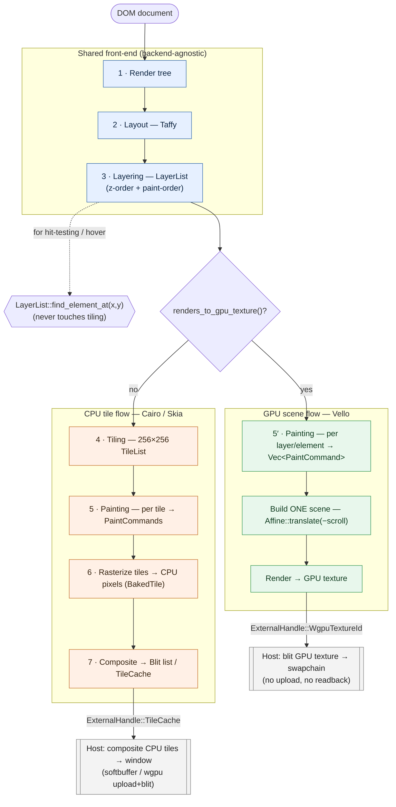

# Render flow: CPU tiles vs. GPU scene

This document describes how a tab's frame is produced, and how the pipeline branches
between the **CPU tile flow** (used by CPU rasterizers such as Cairo and Skia) and the
**GPU scene flow** (used by GPU renderers such as Vello).

The two flows share their entire front-end. They diverge only after layering, where the
CPU flow tiles + rasterizes + composites, while the GPU flow paints the whole viewport
into a single scene and renders it straight to a GPU texture.

## Stages

| # | Stage | Output | CPU flow | GPU flow |
|---|-------|--------|:--------:|:--------:|
| 1 | Render tree (DOM → render tree) | `RenderTree` | shared | shared |
| 2 | Layout (Taffy) | `LayoutTree` | shared | shared |
| 3 | Layering | `LayerList` (z-order + paint-order elements) | shared | shared |
| 4 | Tiling | `TileList` (256×256 grid) | ✓ | — skipped |
| 5 | Painting | `PaintCommand`s (`Text` / `Rectangle` / `Svg`) | per tile | per layer/element |
| 6 | Rasterize | CPU pixels (`BakedTile`) | ✓ | — skipped |
| 7 | Composite | `Blit` display list / `TileCache` handle | ✓ | — skipped |

Stages 1–3 are backend-agnostic and run identically for every backend. Stages 4, 6 and 7
are the CPU-rasterizer tax; the GPU flow replaces them with a single scene render.

## Flow diagram



## Shared front-end, then a branch

```
                          ┌─────────────────────────────┐
                          │  1. Render tree   (DOM→RT)   │
                          │  2. Layout        (Taffy)    │   ← backend-agnostic
                          │  3. Layering      (LayerList)│     (run once, same for all)
                          └──────────────┬──────────────┘
                                         │
                         LayerList ──────┼──────► hit-testing / hover
                         (z-order +      │        LayerList::find_element_at(x,y)
                          paint order)   │        (never touches tiling)
                                         │
                  ┌──────────────────────┴───────────────────────┐
        raster_strategy != None                      renders_to_gpu_texture() == true
        && !renders_to_gpu_texture()                          (Vello, future GPU)
            (Cairo / Skia)                                          │
                  │                                                 │
                  ▼                                                 ▼
```

## CPU tile flow vs. GPU scene flow

```
   CPU TILE FLOW                                  GPU SCENE FLOW
   ─────────────                                  ──────────────
   4. Tiling                                      (no tiling)
      LayerList → 256×256 TileList
                  │
   5. Painting (per tile)                         5'. Painting (per layer/element)
      tiled elements → PaintCommands                  walk layer_ids → elements
                  │                                    → ordered Vec<PaintCommand>
                  ▼                                              │
   6. Rasterize tiles → CPU pixels                (no rasterize, no readback)
      Cairo/Skia: CPU, rayon-parallel
      [Vello today: GPU render → GPU→CPU                         │
       readback per tile]                                        │
                  │                                              │
   7. Composite                                   6'. Build ONE scene from commands
      tiles → DisplayItem::Blit list                  Affine::translate(−scroll)
      → ExternalHandle::TileCache                      render → output GPU texture
                  │                                  → ExternalHandle::WgpuTextureId
                  ▼                                              │
   HOST: composite CPU tiles → window              HOST: blit GPU texture → swapchain
   (softbuffer / wgpu upload+blit)                 (one textured triangle, no upload)
```

## What each path caches

```
   CPU path cache (PipelineCache)         GPU path cache (SceneCache)
   ──────────────────────────────        ───────────────────────────────
   • LayerList   (hover)                  • LayerList            (hover)
   • baked tiles (CPU pixels)             • Vec<PaintCommand>    (the scene)
   • tile_pixel_cache (dirty reuse)       • page_height
   • scroll fast-path handle              scroll = just change the translate;
   hover = pipeline_hover_repaint         hover  = rebuild commands + re-render
   (re-raster only affected tiles)        (cheap; no per-tile bookkeeping)
```

## Why the GPU flow exists: today's Vello waste

Vello is a GPU renderer, but it is currently driven through the CPU tile flow. That means
every tile is rendered on the GPU, copied **back** to the CPU, then copied **forward** to
the GPU again to composite the final frame:

```
  current:  paint → [GPU render tile] → GPU→CPU readback → CPU tile
                  → CPU→GPU re-upload (peniko::Image) → composite scene → texture
                     └──────────── 2× bandwidth + per-tile poll-stall ───────────┘

  new:      paint → build one scene → [GPU render] → texture
                     └──────────── stays on the GPU the whole time ─────────────┘
```

The readback (`copy_texture_to_buffer` + `map_async` + a blocking `device.poll`) is
per tile and synchronous, which serializes the frame. The GPU scene flow removes the
round-trip entirely: pixels never leave the GPU between rasterization and presentation.

## Hover / hit-testing is a layering concern

Hit-testing does **not** depend on tiling. The engine calls
`LayerList::find_element_at(x, y)`, which walks layers top-to-bottom (z-order) and each
layer's elements, doing a box-model containment test. The `LayerList` is produced in
stage 3 and kept in the path's cache, so both flows hit-test identically.

Consequence: dropping tiling for the GPU flow does not affect hover. The GPU cache simply
keeps the same `Arc<LayerList>` for `find_element_at`, alongside the paint-command list it
renders.

## Layers and z-order (including images)

Layers are created in stage 3 (`LayerList::generate_layers` / `traverse`). Notably, ``
elements are placed on their own layer above the default layer, so image stacking is a
layering decision, upstream of both flows.

To reproduce the CPU flow's z-order exactly, the GPU paint walk must iterate in the same
order the tiler uses:

```
for layer_id in layer_list.layer_ids   // stored order = z-order, bottom→top
    for element_id in layer.elements    // stored order = paint order
        emit paint commands → scene
```

This is the same nesting the tiler applies; rendering it into one scene rather than per
tile yields identical layering and stacking.

## Selecting the flow: the backend contract

The branch is keyed off a backend capability, not off any specific renderer:

- `RenderBackend::renders_to_gpu_texture()` — default `false`. Returning `true` routes the
  tab worker to the GPU scene flow and makes the host present an
  `ExternalHandle::WgpuTextureId`.
- `RenderBackend::raster_strategy()` — controls how tiles are rasterized on the CPU flow
  (`Sequential` / `ParallelCached` / `None`). A GPU backend still reports a non-`None`
  strategy so the shared pipeline knows it produces drawable content, but the worker skips
  the tile path because `renders_to_gpu_texture()` is `true`.

Everything that makes the GPU flow work — the worker branch, the `SceneCache`, the
"paint over the layer list" walk, and `WgpuTextureId` presentation — is backend-agnostic.
The **only** backend-specific piece is `RenderBackend::render()`: translating
`PaintCommand` (`Text` / `Rectangle` / `Svg`) into that backend's native scene API.

So the contract for "I am a GPU renderer" is exactly two things:

1. Return `true` from `renders_to_gpu_texture()`.
2. Implement `render()` to consume the viewport's `PaintCommand`s into a GPU texture.

A future wgpu / WebGPU / Skia-Ganesh backend would reuse the entire flow and implement
only those two methods.

> **Caveat (state of the tree):** Vello is currently the *only* GPU-scene backend.
> `winit-skia-gpu` uses GL/Glutin to present Skia's **CPU** raster output — it is not a
> GPU-scene renderer. So the "backend-agnostic" claim above is design intent validated by
> a single implementation; expect minor interface adjustments when a second GPU backend
> lands.
