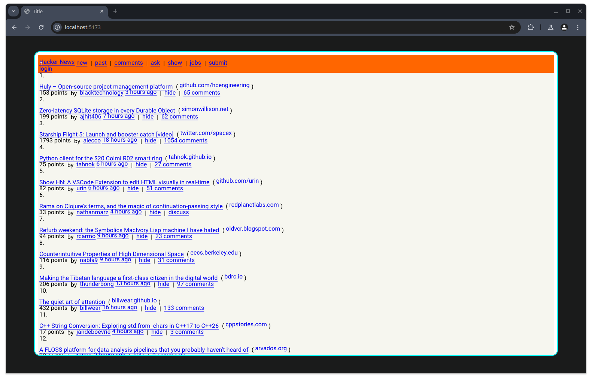

# WebAssembly

The engine compiles to WebAssembly and runs in a browser tab, driving a canvas through the
Vello/wgpu backend. What you get is the engine itself — parsing, layout and rendering — hosted
by the thin user agent in [`wasm/`](../wasm).

> **Status: this does not build today.** `wasm-pack build --target web` fails in `mio`, which
> `tokio` pulls in through `gosub-sonar` and `gosub_engine`. mio's TCP types have no
> `wasm32-unknown-unknown` implementation, so the build stops with ~48 type errors in mio before
> it reaches any engine code. The rest of this page describes the intended flow; the tokio/mio
> dependency has to stop reaching the wasm target before it works end to end.

## Prerequisites

```bash
rustup target add wasm32-unknown-unknown
cargo install wasm-pack
```

You also need [bun](https://bun.sh) or Node for the dev server. No GTK, Cairo or fontconfig
packages are involved: the wasm build uses the Vello backend and leaves the native-only crates
out (see the `cfg(target_arch = "wasm32")` sections of the root `Cargo.toml`, which also drop
V8 and the SQLite cookie store).

## Building

Run `wasm-pack` **from the repository root**, not from `wasm/`. It writes its output to `pkg/`,
which is what the wrapper imports (`wasm/index.html` loads `../pkg/gosub_engine.js`):

```bash
wasm-pack build --target web
```

Then serve the wrapper:

```bash
cd wasm
bun run dev   # or: npm run dev
```

## Running the demo

You need a Chromium with WebGPU enabled:

```bash
# Linux only — PRs welcome for Windows / macOS
chromium --disable-web-security --enable-features=Vulkan \
         --enable-unsafe-webgpu --user-data-dir=/tmp/chromium-temp-profile
```

`--enable-unsafe-webgpu` and `--enable-features=Vulkan` turn on the WebGPU backing that Vello
renders through. `--disable-web-security` is there because the engine fetches pages and
sub-resources through the host browser, and the sites it loads never opted into CORS — without
it every cross-origin fetch is blocked and pages come up empty.

That last flag turns off the same-origin policy for the whole browser session, so keep it to the
throwaway `--user-data-dir` profile shown above and don't use that profile for anything else.


