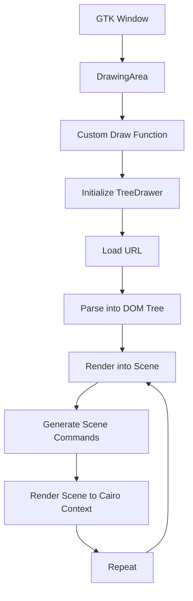

# GTK Renderer Example

This example demonstrates how to use the GTK renderer to render a website in a GTK window.

## Usage

```bash
cargo run --release --package gtk-renderer -- <URL>
```

## Workings

We setup a very simple GTK window with a single DrawingArea widget. We connect our renderer
to it by implementing a custom draw function for the DrawingArea. This function is called
whenever the DrawingArea needs to be redrawn. 

On the first draw, we will initialize a treedrawer in a async block. This will load the URL, 
and parses it into a DOM tree. Then it will retrigger a draw of the drawing area.

On the second and consecutive draws, the tree drawer will render the tree into a scene.
A scene is a list of commands that needs to be executed by the renderer in order to draw 
something onto the screen.

After this drawing, we render the scene to the cairo context of the drawing area.


## Differences between vello and cairo

We currently have two rendering systems: vello and cairo. Vello is a renderer that works
well within a winit window. Cairo is a renderer that works well within a GTK window. 
Theoretically it should be possible to use the vello renderer in a GTK window, but this turns
out to be quite difficult. 

Cairo can render to a surface, which could be a buffer or image. It should be possible to 
render to an internal buffer, and use this buffer to display onto the screen, but this might
cause a lot of overhead since we need to copy a buffer on each frame.

Vello also uses a different method on rendering than cairo. Vello uses a scene graph, which
is a list of commands that needs to be executed in order to draw something. Cairo uses a
context, which is a stateful object that can be used to draw something. Once you draw onto 
the context it will be executed immediately. Our renderer cannot really work this way, as 
there are multiple scenes that needs to be drawn in the correct order.

We fix this by making the storing all commands that cairo needs to execute into a scene (just 
like vello does internally). This means that both vello and cairo can create render commands, 
merge scenes into each other, even remove scenes or commands if needed.

At the end of the line, there will be a render() function, that will execute all the cairo 
commands found in the scene and apply it onto a context.



